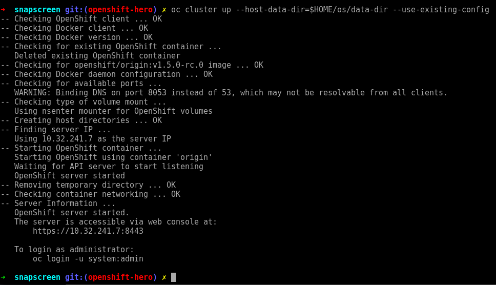

# Openshift in 30 mins with a Node.JS application #

These steps presume you already have Docker installed. If you don't, look at this quickstart docker guide, or install Docker from [here](insert-link). Before you proceed any further confirm you can run docker process commands by trying `docker ps`

## Installing Openshift ##

### Installing the oc cli tool ###

Download the Linux [oc binary](https://github.com/openshift/origin/releases) and place it in your path.

## Bring your cluster up ##

Bring up your cluster by running:

* `oc cluster up --public-hostname=127.0.0.1 --host-data-dir=$HOME/os/data-dir --host-config-dir=$HOME/os/config-dir --use-existing-config`

If successful you should see output like the following:

### Troubleshooting ###

If you encounter any errors the error messages are generally helpful enough to diagnose and resolve the issue. Some issues that were encountered included:

* the docker service daemon/ service was not running or needed to be restarted

### OpenShift console ###

Once you have successfully brought your cluster up you should be able to access the OpenShift console through the url specified at the end of your `oc cluster up` log. 

<insert-image-of-openshift-console>

## Deploy your app to OpenShift ##

Deploy your app by executing:

* `oc new-app <dockerhub-username>/<dockerhub-image-name>`

In the OpenShift console you should see your app spinning up in its pod. 

To access your app, you will need to create an external-facing route to it. Do this by:

* `oc expose service/<name> --hostname=<www.example.com>`

Congratulations! You have now deployed your app on OpenShift and should be able to 

## Bringing down your cluster ##

To bring down your cluster `oc cluster down` will do so.

